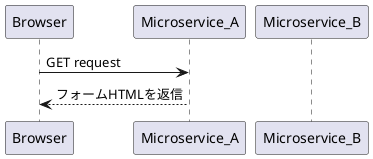
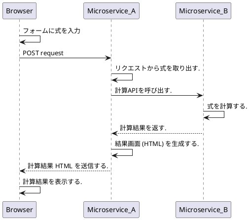

Encoding: UTF-8

# 開発環境

## 事前準備

以下のソフトウェアをあらかじめインストールしておく. python, pipenv は環境変数 PATH に登録して実行可能としておく.
- Python 3.9.0 or newer
- Python ライブラリ: pipenv
- エディタ: Visual Studio Code
   - 以下の Extension をインストールする.
   - Python, Pylance
   - PlantUML (jebbs.plantuml)
   - Markdown Preview Enhanced (shd101wyy.markdown-preview-enhanced)
   - Markdown Preview Mermaid Support (bierner.markdown-mermaid)

PlantUML, Markdown Preview Enhanced, Markdown Preview Mermaid Support をインストールしないと試験問題のシーケンス図が読めないので注意する.

インターネットに接続可能な環境で開発する. 環境構築時にインターネットからいろいろなライブラリをダウンロードするので, なるべく WiFi あるいは有線インターネット接続環境にて実施することが望ましい.

## 環境構築

1. Python 3.9.1 をインターネットからダウンロードしインストールする.
   - ほかに Python がインストールされていたら, この 3.9.1 が使われるように環境変数 PATH を設定する.
1. コマンドプロンプトを開く.
   - すでに開いているコマンドプロンプトがあったらいったんすべて閉じて開き直す.
1. pipenv をインストールする.
   - コマンドプロンプトを開いて `pip install pipenv` を実行する.
1. Windows 10 の設定画面から以下の環境変数を登録する.
   1. 設定 (スタートメニューの歯車アイコン) -> システム -> 「バージョン情報」を開く
   1. 右上にある「システム情報」のリンクをクリックする. -> 「システム」というタイトルのコントロールパネルウィンドウが開く.
   1. 「システム」画面の右上の方にある「シスエムの詳細設定」をクリックする. -> 「システムの詳細設計」というウィンドウが開く.
   1. 「環境変数」ボタンを押す. -> 「環境変数」というタイトルのウィンドウが開く.
   1. 「ユーザ環境変数」欄の下にある「新規...」ボタンを押して環境変数を追加する.
      - 変数名: PIPENV_VENV_IN_PROJECT
      - 変数値: true
         - これは Python 仮想環境をホームディレクトリではなくプロジェクトディレクトリに置くようにする設定を追加するものである.
   1. OK ボタンを押して環境変数新規追加ウィンドウを閉じる.
   1. OK ボタンを押して環境変数ウィンドウを閉じる.
   1. システムの詳細設定ウィンドウ, 「システム」ウィンドウ, 「バージョン情報」ウィンドウもすべて閉じる (OKでもキャンセルでも結果は同じ).
1. C:\iiga-trial ディレクトリを作成する.
1. iiga-trial.zip の内容を C:\iiga-trial に解凍する.
1. もし VisualStudio Code が動いていたらすべて閉じる.
1. コマンドプロンプトを開く.
   - すでに開いているコマンドプロンプトがあったらいったんすべて閉じて開き直す.
1. `cd C:\iiga-trial` を実行してカレントディレクトリを変更する.
1. `pipenv install` を実行する.
   - 開発に必要なライブラリが自動でインストールされる
   - 実行終了後に, C:\iiga-trial\.venv ディレクトリができていることを確認する.
      - もし .venv ディレクトリがなかったらイイガの担当者に問い合わせる.
1. VisualStudio Code を起動し Open Folder から C:\iiga-trial を開く.

# サンプルについて

## サンプルの内容

- flask を用いた web application (Web Service, Microservice) である.
- src ディレクトリにソースコードがある
- test ディレクトリにテストコードがある
- src/app.py が実行対象となるソースである.
   - HTTP リクエスト "GET / HTTP/1.1" に対して Hello world と追加メッセージをレスポンスとして返すシンプルな Web application である.

## サンプルの実行方法

1. 開発環境:事前準備を完了させておく
1. Visual Studio Code の Terminal -> New Terminal を開く.
   1. Windows 環境ならば PowerShell が開くはず.
1. PowerShell で以下のコマンドを実行する.
   1. `pipenv shell` を実行
   1. `pipenv install` を実行
   1. `python .\src\app.py` を実行 -> Web Application が起動する.
1. "Running on http://127.0.0.1:5000/ (Press CTRL+C to quit)" というメッセージが表示されるので, URL を Ctrl+クリックし, ブラウザで画面を表示させる.
1. "Hello, World!'Hello from nested_script''Hello from root_script'" というメッセージが表示されたら正常に動作している.

# 試験

## 概要

2つのマイクロサービスを作成する.

## 機能(概要)

各マイクロサービスの機能は以下のように定義する.
1. マイクロサービスA
   1. 計算機能を提供する.
   1. Web API を 1 つ実装する. リクエストパラメータとして計算式を取り, 計算結果をレスポンスとして返す.
1. マイクロサービスB
   1. フォームを表示する.
   1. フォームに計算式を入力して "Calculate" ボタンを押すと, マイクロサービスAの Web API を呼び出して計算を依頼し, 結果を表示する.

## 実装

- Python で実装すること.
- Web Application Framework として flask を用いる
- マイクロサービスA とマイクロサービスB は別プロセスとして実行する.
- サンプルプロジェクトは任意の py ファイルを開いた状態で F5 キーを押すとデバッグ実行されるように設定されている.

## テスト

以下の2つの方法でテストする.
- unit test を作成してテストする
   - サンプルの unit test が ./test/test_app.py にあるので参考にすること.
- curl コマンドを用いて HTTP GET/POST をして動作確認をする.

## シーケンス

マイクロサービス間の連携は以下のシーケンスで実施する.

### フォーム表示

1. Web ブラウザを開く.
1. Web ブラウザ上でマイクロサービスAのURLを入力して画面を表示する.
   - Web ブラウザに計算式の入力フォームが表示される.
   - TextArea と Button が配置されている.
   - TextArea には式を入力する.
   - Button には "Calculate" と書いてあり, ボタンを押すと「計算実行」のシーケンスを実行する.

### 計算実行

1. Web ブラウザに表示されているフォームに計算式 (Ex. 1+1) を入力する.
1. Web ブラウザ上の Calculate ボタンを押す.
   - POST リクエストが実行される.
1. マイクロサービスAは式を受け取り, その式をマイクロサービスBの計算サービス (Web API) に送信する.
1. マイクロサービスBは式を計算して結果をマイクロサービスAに返す.
1. マイクロサービスAは計算結果画面を生成しブラウザに返す.
1. ブラウザ上に計算結果が表示される.

## インターフェース仕様について

以下の条件を満たすように自分で定義すること.

|条件|内容|
|---|---|
|URL|適当な名前|
|文字エンコーディング|UTF-8|
|Content-Type|JSON (application/json)|

### ヒント: 計算サービスの例

#### リクエスト仕様
- URL: http://host:port/calculate
- 必須 HTTP ヘッダー
   - なし
- HTTP ボディ
   - JSON 形式

JSON のフォーマット
|key|value|mandatory|
|---|---|--|
|equation|計算式|必須|

例) { "equaltion": "1+1"}

#### レスポンス仕様

- HTTP ステータスコード
   - リクエストに必須項目が存在した場合: 200 (OK)
   - リクエストに必須項目がなかった場合: 400 (Bad Request)
- 必須 HTTP ヘッダー
   - なし
- HTTP ボディ
   - JSON 形式

JSON のフォーマット
|key|value|
|---|---|
|result|計算結果|
|errorMessage|エラーメッセージ|

例) { "result": "2"} ( リクエストが 1+1 だった場合 )
例) { "errorMessage": "SyntaxError: invalid syntax"} (リクエストが "9hoge1" だった場合)

上記エラーメッセージはあくまで例であり, 実際には計算に用いるクラス/メソッドが出力するエラーメッセージを表示すればよい.
